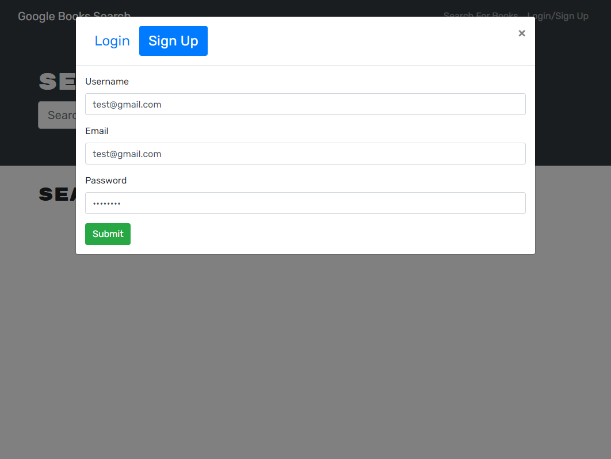
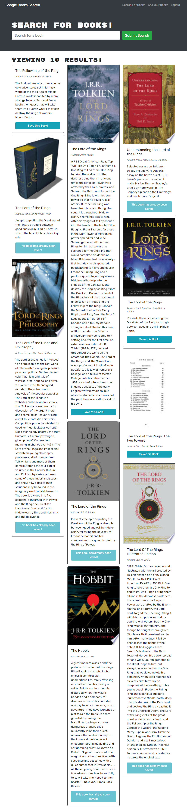

# Beyond Book Search


[](https://opensource.org/licenses/MIT)


## Contributors
---------------
[Chris Kimball](https://github.com/chirskimball "chirskimball's GitHub Profile")


## Description
---------------
The following project is a full MERN stack application that leverages the Google Books API search engine to allows users to create an account, look up books in the Google Books API and then add them to their collection. This app React as its front end, MongoDB database, and Node.js/Express.js server and API. It also uses GraphQL API via Apollo server to handle RESTful API requests.

Upon initial load users will be able to search for books, however they will only to view results and not add them to collection until they are signed into an account.

Unauthenticated users will be given the option to log in/signup in the navbar. When they click the log in/signup link the page will re-render the login/signup form components.

When the sign up form is filled in with a valid username, email address, and password an account will be created in the database and the user will be authenticated into the application via a JSON web token.

Now the user will be able to log in at any time via the same log in/signup link. 

Once logged in when users search for books, a button will render in each book 'card' which gives them the option to save the book to their collection. If the user clicks the button it will add that book to the user's document in the database.

They can then select the 'See your books' option in the navbar which will display all saved books for the user. On this page they will also see a count of the number of books in their collection as well as buttons to remove books from their collection.


## Table of Contents
---------------
* [Web Addresses](#web-addresses)
* [Installation](#installation)
* [Usage](#usage)
* [License](#license)
* [Technology Used](#technology-used)
* [Screenshots](#screenshots)
* [Questions](#questions)


## Web Addresses
---------------
*  [Github Repository](https://github.com/chriskimball/beyond-book-search "Github Repo")
*  [Deployed Application on Github Pages](https://beyond-book-search.herokuapp.com/ "Deployed Application on Github Pages")


## Installation
---------------
1. Clone this Git repository
2. Navigate to repository in local directory.
3. To install any necessary dependencies, run the following script:
```bash
npm run install
```
4. Build the application:
```bash
npm run build
```


## Usage 
---------------
You will need node.js to run this application. Once the repository has been cloned and application files have been built, navigate to the file directory, open a new terminal and run the following script.

```bash
npm run start
```

This will start the server on http://localhost:3000/ however you can also access a deployed version of this site at https://beyond-book-search.herokuapp.com/.


## License
---------------
This project is licensed under the MIT license.


## Technology Used 
---------------
* HTML/CSS
* JavaScript
* React.js
* Express.js
* GraphQL
* MongoDB
* Mongoose
* Apollo
* JSON Web Token (JWT)
* Bcrypt
* Bootstrap
* Nodemon
* Google Books API


## Screenshots
---------------
#### Signup form


#### Search form while authenticated


#### Saved Books / Profile


## Questions
---------------
If you have any questions about the repo, open an issue or contact me directly at [chriskimball.dev@gmail.com](mailto:chriskimball.dev@gmail.com). You can find more of my work at [chirskimball](https://github.com/chirskimball "chirskimball's GitHub Profile").